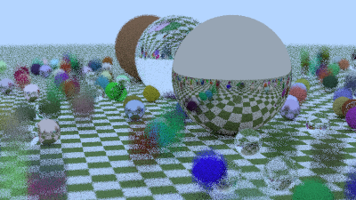
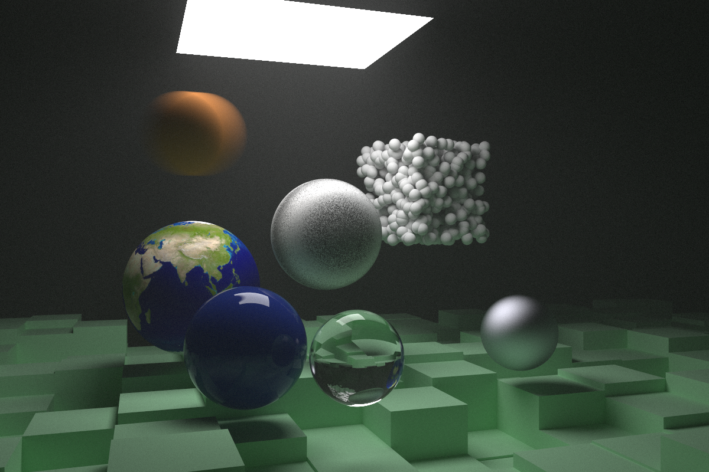

# Julia implementation of Raytracing in a weekend series

Chris Lomont Nov 2020

MIT Licensed

This is my first [Julia](https://julialang.org/) program, which is an implementation of the [Ray Tracing in One Weekend](https://raytracing.github.io/) series, the first two weekends. I did this to see how nice Julia is to develop in, how quickly I can get into the base language, and most importantly, how performant it is. 

The first pass I wrote in a fairly immutable object style, common in F# and other functional languages, to see how well the compiler can optimize away unneeded allocations and behavior.

The first pass was made in a Jupyter notebook, JuliaRaytracer.ipynb. After getting it running, performance on the final day scene in the size/quality combo I tagged as SmallFast reported julia @time as taking 97.873641 seconds (2.36 G allocations: 68.617 GiB, 5.95% gc time). Here is the image:

This is a bit slow in my opinion for a language that is supposed to be fast, but I knew it was my fault for not understanding how Julia manages types, code, etc., so I decided to speed it up. Here are the steps I took for reference (trying to follow Julia forum threads, etc., and especially the [Julia Performance Tips](https://docs.julialang.org/en/v1/manual/performance-tips/) page).

Sloppy notes - 

1. added scatter count - should track scatterings that happened - same performance, scatter count 1503519 = 1.5M for image of size 400x225 = 90k pixels
2. moved to VS code, all in one file to start (1890 lines of code): same perf, count as above
3. No longer could see image in vscode, so removed colorview(image): same perf
4. TODO - remove allocations - Ray, Color, HitRecord, Vec3, Point3, etc.., where possible, in hot path, change shifted/rotated hits to modify ray on pre and post somehow to avoid allocation?
   1. Removed ray allocations - made Ray mutable, got 94.806724 seconds (2.06 G allocations: 49.864 GiB, 3.57% gc time)
   2. Changed hit() functions to take a mutable HitRecord instead of creating one every hit: 24.516214 seconds (707.93 M allocations: 12.045 GiB, 7.53% gc time)
   3. Changed scatter to take a color parameter to set (attenuation) instead of creating and returning it: 24.776722 seconds (700.35 M allocations: 11.728 GiB, 7.31% gc time) - image was garbage - required making mutable color class
5. mutable color class: 24.454554 seconds (691.88 M allocations: 11.330 GiB, 7.46% gc time)
6. move HitRecord to main loop: 21.928959 seconds (673.50 M allocations: 10.682 GiB, 7.62% gc time)
7. Moved ray out of loop, now one per pixel instead of one per sample: 21.839745 seconds (677.62 M allocations: 10.762 GiB, 7.37% gc time)
8. Added several global stats accesses - became very slow! Scatter count 1500292, rays 0, hits checked 307943747, boxes traversed 223773287, bvh hits checked 223773287
   137.026199 seconds (4.46 G allocations: 67.050 GiB, 8.10% gc time)
9. removed all global stats accesses, faster: 21.067686 seconds (670.12 M allocations: 10.650 GiB, 7.57% gc time)
10. Changed @showprogress with Threads. (Had to edit num threads in VSCode under file, preferences, extensions, julia - didn't work. Added JULIA_NUM_THREADS=4 to system environment vars, restarted vs code, # threads took): 9.116466 seconds (670.79 M allocations: 10.677 GiB, 32.89% gc time), moved ppm writing to after the render. **At this point I have achieved a 10x performance gain**.
11. Since fast, up the number of rays and size to slow back down: change to MediumSlow 16.0/9.0 aspect,800 width,40 rays/pixel,10 depth: get  122.327651 seconds (10.76 G allocations: 168.733 GiB, 41.90% gc time)
12. TODO - try @inbounds and @simd in various places, @fastmath where appropriate
    1. Added @inbounds  to function hit(b::AABB...) : 121.036132 seconds (10.76 G allocations: 168.688 GiB, 41.94% gc time)
    2. Fixed bug in line `tmax = t1 < tmin ? t1 : tmax` to `tmax = t1 < tmax ? t1 : tmax`, got  49.660671 seconds (4.11 G allocations: 69.565 GiB, 41.60% gc time)
13. At this point, **up ~30x performance gain**
14. Changed `Union{Hittable,Nothing} in BVHNode to Hittable`, no change
15. Ran final scene here: Num threads 11, Time: 1 days, 3:14:16 , 98058.503672 seconds (6.62 T allocations: 136.247 TiB, 24.92% gc time)
16. TODO - switch to Float32 instead of Float64 with `const Float = Float32` at top: 
17. TODO - make ray_color not recursive
18. try @code_warntype
    1. On ray_color

Final render, 10,000 rays per pixel, 50 depth, basically scene 17 in my code, speed/quality setting LargeExtreme. The final code is the file raytracer.jl

The end (for now)